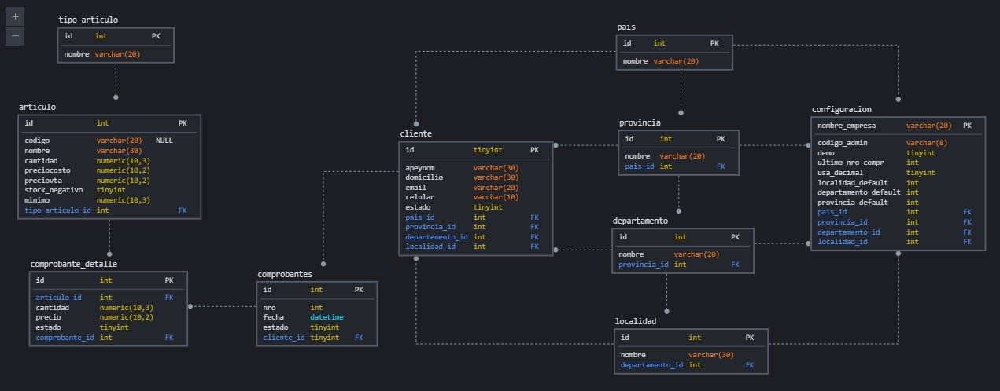

# Proyecto Final Programación III // npm start

El alumno deberá desarrollar en forma grupal un sistema de gestión de stock y ventas básico. 
El mismo consta de dos partes la primera es el backend, con la siguiente estructura de base de datos implementada en mySql con un backend realizado en nodejs con express.

  

Y la segunda de una aplicación web (frontend) realizada en javascript, usando html y css, con las siguientes funcionalidades.
Funcionalidades mínimas del sistema:
-	Dos modos de acceso, uno como administrador con clave y otro como usuario sin clave, el modo administrador tiene acceso a todas las funciones mientras que el usuario solo a la venta. 
-	Administración de la tabla de configuración del sistema (solo en modo admin).
-	CRUD de las tablas de parametrización (país, provincia, clientes, etc.)
-	Venta de artículos restando el stock, manejando comprobante para registrarlas.
-	Anulación de venta (baja lógica del comprobante) sumando stock.
-	Aviso de faltante de artículos (cuando cantidad este por debajo del mínimo).
-	Reportes:
o	Ventas totales (con filtros por fechas).
o	Ventas por artículos (con filtros por fechas).
o	Ventas por clientes (con filtros por fechas).
o	Reporte de artículos. 
o	Reporte de artículos para reponer.
Utilizar views, triggers, storeprocedures y/o functions para la gestión de datos como numero de comprobante, descarga de stock, reportes etc.

